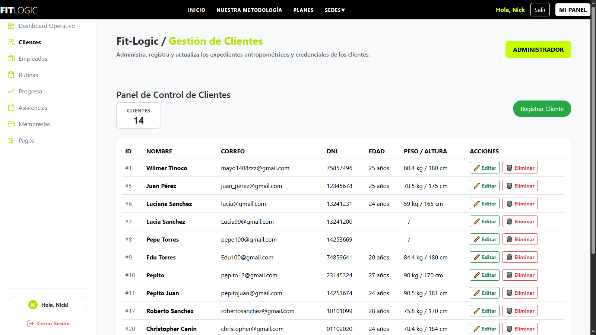
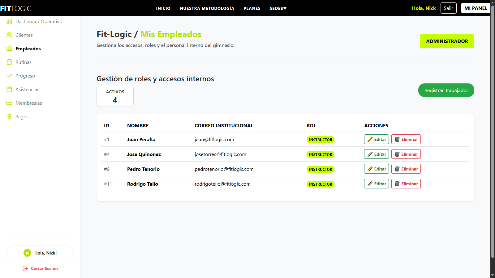
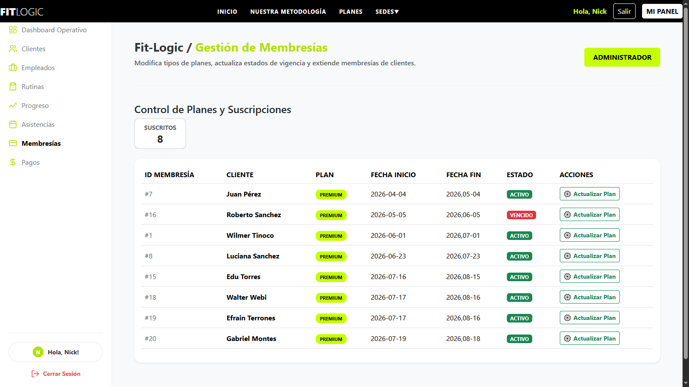
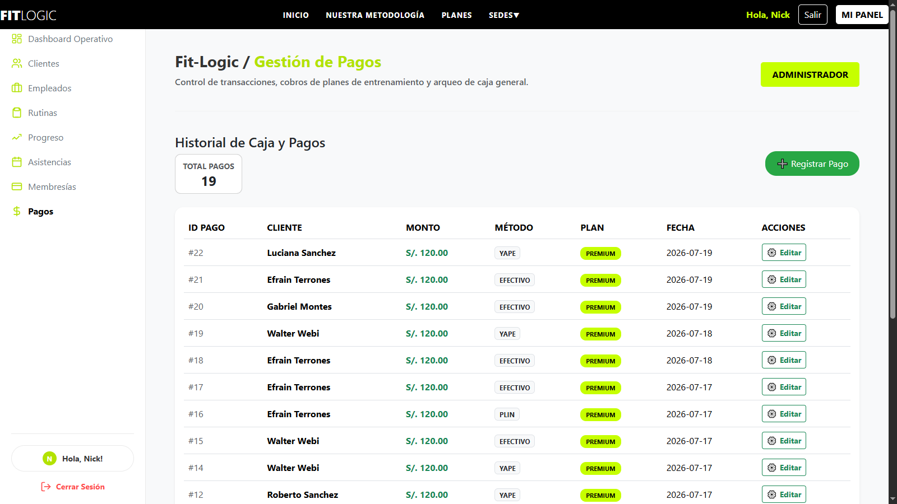
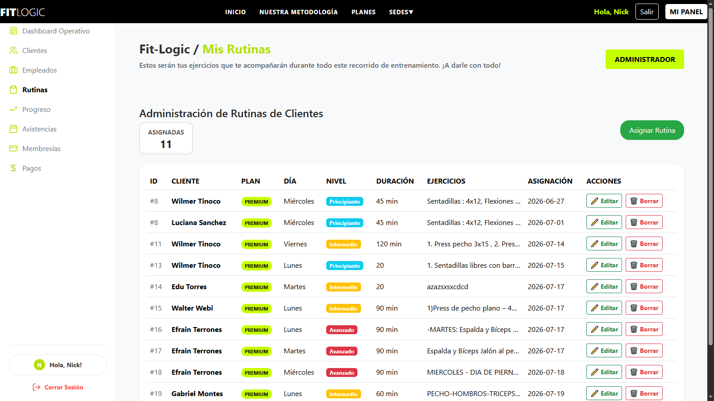
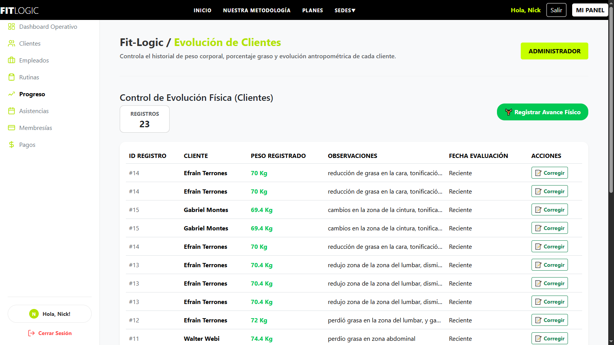
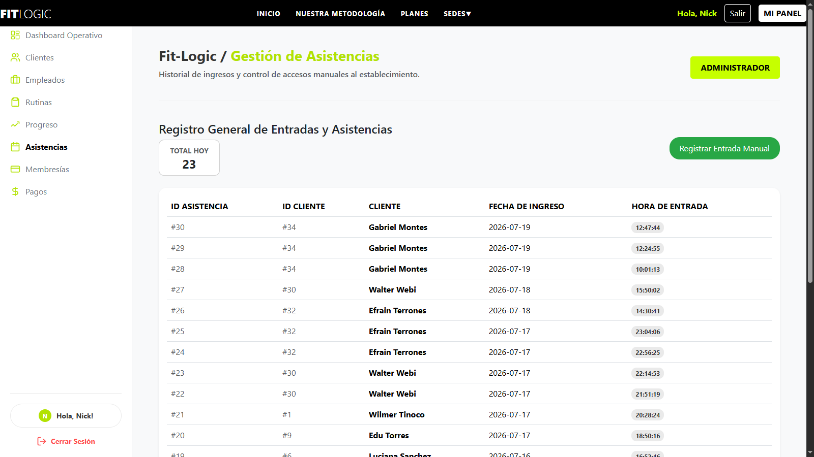
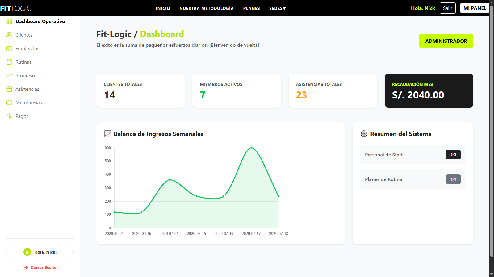

# Fit-Logic - Sistema de Gestión para Gimnasios 🏋️‍♂️


## 🏢 Descripción de la Empresa
En los últimos años, la industria fitness ha experimentado un crecimiento significativo debido al incremento del interés por la salud física, el bienestar personal y la estética corporal. Los gimnasios modernos no solo ofrecen equipamiento para entrenamiento, sino también servicios digitales que permiten mejorar la experiencia del usuario y optimizar la gestión administrativa.

Fit-Logic surge como una propuesta tecnológica orientada a integrar herramientas digitales para automatizar procesos como el control de membresías, generación de rutinas personalizadas y seguimiento del progreso físico de los clientes.

## ⚠️ Problemática
El gimnasio Fit Logic presenta una deficiencia al no contar con un sistema automatizado que oriente a los socios en la elaboración de rutinas de entrenamiento. Esta situación se agrava debido a la alta cantidad de clientes y la limitada disponibilidad de entrenadores, lo que impide brindar atención individualizada. 

Como consecuencia, muchos usuarios realizan ejercicios sin una guía adecuada, lo cual limita significativamente sus resultados físicos. Esto incrementa el riesgo de lesiones, la desmotivación y el abandono del gimnasio. Asimismo, la falta de integración entre entrenamiento, seguimiento físico y control de membresías genera ineficiencias operativas y pérdidas económicas para la organización.

---


## 🎯 Objetivos

### Objetivo General
* Desarrollar un sistema integral en Python basado en Programación Orientada a Objetos que automatice la generación de rutinas de entrenamiento y el control de membresías, con el fin de optimizar la atención a los clientes, reducir la carga del personal trainer y mejorar la retención y resultados físicos de los usuarios.

### Objetivos Específicos
* Diseñar e implementar un módulo de generación automática de rutinas de entrenamiento basado en el perfil del usuario (edad, peso, objetivo y nivel de experiencia).
* Implementación de seguimiento del progreso físico del cliente (peso, medidas y evolución).
* Desarrollar un sistema de gestión de membresías que valide el estado de pago y controle el acceso de los usuarios.
* Reducir la dependencia del entrenador mediante la automatización de procesos repetitivos.
* Generar reportes administrativos sobre rendimiento de clientes, ingresos y tasa de abandono.

---


## 👥 Descripción del Proyecto y Roles
El sistema define perfiles de acceso diferenciados (control de roles) para adaptarse a la operación diaria del gimnasio Fit Logic. Los principales roles del sistema son los siguientes:

* **ADMIN:** Jefe Principal. Administra todo dentro del sistema (empleados, usuarios, rutinas, pagos) y visualiza todos los reportes logísticos del sistema.
* **EMPLEADO:** Apoya la operación diaria: registra las entradas de los clientes, actualiza rutinas y esta presente para responder las consultas de los clientes.
* **CLIENTE:** Principal consumidor del servicio. Reliza sus pagos y elige sus rutinas.

---


## 🚀 Tecnologías Implementadas
* **Frontend:** React, Bootstrap, FastAPI.
* **Backend y Base de Datos:** Node.js, PostgreSQL, Python, Flask.

---

## ⚙️ Requisitos Previos

Antes de ejecutar el proyecto localmente, asegúrate de tener instalado:
* Node.js (Versión 16+ recomendada)
* Python 3.x
* PostgreSQL (acceso a instancia en la nube)
* Git
* Neon DB (servicio en la nube)

## 🛠️ Instalación y Ejecución

El proyecto opera con una arquitectura que separa el cliente (Frontend) del servidor (Backend).

### 1. Despliegue del Frontend
1. Clona el repositorio y navega a la carpeta correspondiente:
   ```bash
   git clone https://github.com/WilmerTinocoGuerrero/Fit-Logic_frontend.git
   npm install


#  Fit-Logic Backend Rama Edu

Este es el módulo del backend para el sistema de gestión de gimnasios **Fit-Logic**, desarrollado en Python utilizando **Flask** y conectado a una base de datos **PostgreSQL** alojada en la nube con **Neon**.

---

## Arquitectura del Proyecto (Estructura de Carpetas)

* **`config/`**: Contiene la lógica necesaria para establecer la conexión con la base de datos.
* **`modelos/`**: Aquí se define la estructura de las entidades del sistema (como Cliente, Membresía, Empleado, Rutina, etc.).
* **`Routes/`**: Se encarga de recibir las solicitudes HTTP del cliente (los endpoints de la API) y direccionar el flujo del sistema.
* **`Service/`**: Contiene la lógica de negocio pura y dura. Las rutas (`Routes`) delegan toda la carga operativa y validaciones a esta capa para mantener el código ordenado.

---

## Configuración del Entorno (`.env`)

Para que el proyecto funcione en tu entorno local, es obligatorio que crees un archivo de configuración para las credenciales:

1. Duplica o guíate del archivo `.env.example`.
2. Crea un archivo llamado exactamente **`.env`** en la raíz de la carpeta `backend/`.
3. Abre el archivo y **edita la contraseña por la de la base de datos (de Neon)**

> **Nota de seguridad:** El archivo `.env` está protegido en el `.gitignore`. Jamás lo agregues al historial ni lo subas a GitHub para evitar exponer las contraseñas.

---

## Librerías y Dependencias

Para poder ejecutar el proyecto, se necesita instalar las siguientes librerías en tu entorno virtual(el entorno virtual crealo dentro de backend):

* **`Flask`**: El framework web principal utilizado para levantar nuestro servidor y manejar el enrutamiento.
* **`flask-cors`**: Extensión de Flask necesaria para permitir peticiones (CORS) desde el frontend y evitar bloqueos en el navegador.
* **`psycopg2`** (o `psycopg2-binary`): El adaptador de base de datos que permite conectar nuestro backend de Python con PostgreSQL.
* **`python-dotenv`**: Librería encargada de leer las variables de entorno del archivo `.env` para cargar de forma segura las contraseñas y puertos.

### Comando para la instalación:
Asegúrate de tener el entorno virtual activo (`.venv`) y ejecuta en tu terminal:

```bash
pip install Flask flask-cors psycopg2-binary python-dotenv
```


##  Desarrollo Reciente: Panel de Administrador (Backend)- Wilmer

Para garantizar un código ordenado, escalable y seguro, hemos estructurado la lógica del **Panel de Administrador** siguiendo el patrón de diseño de separación de responsabilidades. Esto nos permite separar las rutas de la API de la lógica de negocio y las consultas a la base de datos.

### 📂 Nueva Estructura de Carpetas
Se crearon directorios específicos para aislar las funcionalidades exclusivas del administrador:

*   **`routes/admin_routes.py` (Controladores):** 
    En esta carpeta definimos todos los "endpoints" (las URLs) a las que el frontend hace peticiones (por ejemplo, `/api/admin/clientes`). Su única responsabilidad es recibir la petición del cliente (React) y delegar el trabajo pesado al servicio.
*   **`service/admin_service.py` (Lógica de Negocio):** 
    Aquí es donde ocurre la verdadera "magia". Esta carpeta contiene las funciones que procesan los datos, validan la información y ejecutan las consultas directas (SQL) a nuestra base de datos (Neon DB). 

Al separar el panel de admin en `routes/` y `service/`, evitamos tener archivos gigantescos y hacemos que el código sea mucho más fácil de leer y mantener para cualquier desarrollador del equipo.

### 🔒 Seguridad y Variables de Entorno
Para proteger la integridad del sistema, implementamos el uso de un archivo **`.env`** (Environment Variables). 

*   **¿Para qué sirve?** Este archivo nos permite almacenar de forma segura credenciales sensibles, como la cadena de conexión a nuestra base de datos PostgreSQL, contraseñas y claves secretas de la API.
*   **Protección:** El archivo `.env` está estrictamente ignorado en nuestro control de versiones (mediante `.gitignore`). De esta manera, nos aseguramos de que **nadie pueda ver nuestras contraseñas** ni información confidencial al revisar el código fuente en el repositorio público.


## 🛡️ Panel de Administrador: Módulos y Funcionalidades

El Panel de Administrador es el núcleo de gestión de **Fit-Logic**. Está diseñado para ofrecer un control total sobre la operación del gimnasio. A continuación, se detallan los 8 módulos principales implementados, sus capacidades operativas y la evidencia visual de cada interfaz.

### 1. Módulo de Clientes (Usuarios)
Gestión integral de los consumidores del servicio del gimnasio.
* **Crear:** Permite registrar nuevos clientes en el sistema, asignándoles sus datos personales y su objetivo físico inicial.
* **Ver (Leer):** Muestra la tabla completa de clientes con opciones de filtrado y búsqueda.
* **Editar:** Posibilita la actualización de datos personales, cambio de estado (activo/inactivo) y reasignación de objetivos.
* **Eliminar:** Permite dar de baja o eliminar permanentemente el registro de un cliente.



### 2. Módulo de Empleados
Control del personal operativo, como recepcionistas y entrenadores de apoyo.
* **Crear:** Alta de nuevos empleados generando sus respectivas credenciales de acceso al sistema.
* **Ver (Leer):** Visualización de la plantilla de empleados y sus roles asignados.
* **Editar:** Modificación de datos de contacto o actualización de contraseñas.
* **Eliminar:** Revocación de acceso y eliminación del empleado de la base de datos.



### 3. Módulo de Membresías y Pagos
Administración de los planes de suscripción y control financiero de los usuarios.
* **Crear:** Registro de nuevos pagos y vinculación de un cliente a un plan de membresía específico.
* **Ver (Leer):** Historial completo de transacciones, validación de estado de cuenta y fechas de vencimiento.
* **Editar:** Ajuste de fechas de inicio/fin o corrección de montos ingresados.
* **Eliminar:** Anulación de recibos o cancelación de planes por devoluciones.





### 4. Módulo de Rutinas de Entrenamiento
Catálogo centralizado para la asignación de ejercicios.
* **Crear:** Diseño de nuevas rutinas parametrizadas según niveles de experiencia y objetivos físicos.
* **Ver (Leer):** Listado de todas las rutinas estructuradas (formato de lista detallada) disponibles en el gimnasio.
* **Editar:** Modificación de los ejercicios, series o repeticiones dentro de una rutina existente.
* **Eliminar:** Descarte de rutinas obsoletas del catálogo.



### 5. Módulo de Objetivos Físicos
Gestión del catálogo dinámico que alimenta los formularios del sistema para asegurar la integridad referencial.
* **Crear:** Inserción de nuevas metas (ej. Hipertrofia, Pérdida de peso, Tonificación).
* **Ver (Leer):** Visualización de los objetivos disponibles en los menús desplegables.
* **Editar:** Corrección de nombres de los objetivos físicos en la base de datos.
* **Eliminar:** Remoción de metas que ya no se utilizan en los planes del gimnasio.

### 6. Módulo de Progreso Físico
Supervisión de la evolución física de los clientes para evaluar la efectividad de las rutinas.
* **Crear:** Inserción de nuevos controles biométricos (peso, altura, medidas).
* **Ver (Leer):** Acceso al historial evolutivo de cualquier cliente registrado.
* **Editar:** Ajuste de métricas en caso de errores de tipeo al momento del registro.
* **Eliminar:** Borrado de controles duplicados o erróneos.



### 7. Módulo de Asistencias
Control del tráfico diario y uso de las instalaciones por parte de los clientes.
* **Crear:** Registro manual de ingreso (Check-in) en caso de que el sistema automatizado lo requiera.
* **Ver (Leer):** Monitoreo del registro histórico de quién ingresó al local y en qué fecha.
* **Editar:** Corrección manual de registros de asistencia por parte de administración.
* **Eliminar:** Depuración de registros de prueba o fallos del sistema.



### 8. Módulo de Reportes (Dashboard)
Centro de inteligencia y visualización de métricas logísticas del gimnasio.
* **Crear:** Generación de reportes personalizados basados en filtros de tiempo.
* **Ver (Leer):** Visualización gráfica del rendimiento de clientes, ingresos totales, asistencias y tasa de abandono.
* **Editar:** Interacción con los filtros (fechas, categorías) para ajustar la vista del reporte.
* **Eliminar:** (El Dashboard es un módulo de consulta estricta, no requiere eliminación de datos directos).




# React + Vite

This template provides a minimal setup to get React working in Vite with HMR and some ESLint rules.

Currently, two official plugins are available:

- [@vitejs/plugin-react](https://github.com/vitejs/vite-plugin-react/blob/main/packages/plugin-react) uses [Oxc](https://oxc.rs)
- [@vitejs/plugin-react-swc](https://github.com/vitejs/vite-plugin-react/blob/main/packages/plugin-react-swc) uses [SWC](https://swc.rs/)

## React Compiler

The React Compiler is not enabled on this template because of its impact on dev & build performances. To add it, see [this documentation](https://react.dev/learn/react-compiler/installation).

## Expanding the ESLint configuration

If you are developing a production application, we recommend using TypeScript with type-aware lint rules enabled. Check out the [TS template](https://github.com/vitejs/vite/tree/main/packages/create-vite/template-react-ts) for information on how to integrate TypeScript and [`typescript-eslint`](https://typescript-eslint.io) in your project.


